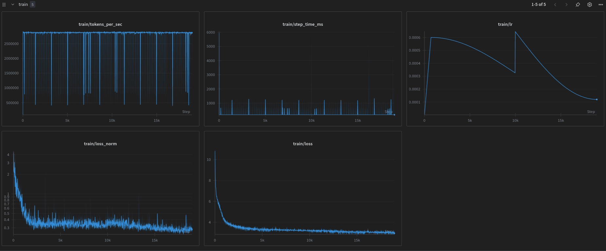

# GPT-2 scale LLM training
This repo follows [Andrej Karpathy's tutorial](https://www.youtube.com/watch?v=l8pRSuU81PU).  
The model is trained on the [Fine web](https://huggingface.co/datasets/HuggingFaceFW/fineweb) dataset.  
Bellow is the are the training metrics, you can find the .

> Note:  
> This is a merged run of four separate run each restarted from the last checkpoint of the previous one.  
> I doubled the learning rate in the middle of the training to try to speed it up but it didn't have a big effect...  
> The validation and hella swag evals are missing here.  
> I later ran a validation loss eval and got `0.3`.  
> I later ran an hellaswag accuracy test and got `30%` which is on part with the results of the tutorial.  